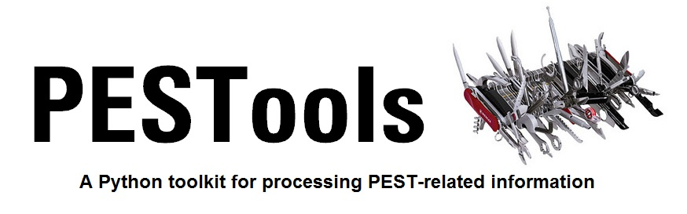

  

PESTools is a Python package for processing and visualizing information associated with the parameter estimation software PEST and PEST++. PESTools consists of a set of Python object classes to facilitate efficient processing and visualization of PEST-related information. Processing and visualization of observation residuals, objective function contributions, parameter and observation sensitivities, parameter correlation and identifiability, and other common PEST outputs have been implemented. PESTools is integrated with the pyemu package (<https://github.com/jtwhite79/pyemu>) package for linear-based computer model uncertainty analyses, allowing for efficient computations using the Jacobian Matrix without any external utilities or files. The use of dataframe objects (pandas Python package) facilitates rapid subsetting and querying of large datasets, as well as the incorporation of ancillary information such as observation locations, times, measurement types, and other associated information. PESTools’ object methods can be easily scripted with concise code, or alternatively, the use of IPython notebooks allows for live interaction with the information.

##Installation
Currently PESTools runs in **Python 2.7**. The Anaconda Python distribution provides a free and easy way to install and maintain python and many popular python packages: (<https://store.continuum.io/cshop/anaconda/>).

####Package dependencies:
* **NumPy**  
* **pandas**  
* **matplotlib**
* **pyemu** (<https://github.com/jtwhite79/pyemu>)  
* **fiona** (only for shapefile methods)  
* **shapely** (only for shapefile methods)

####To install PESTools using pip:
Pip needs to be installed first (e.g. using the Conda package manager in Anaconda):  
 
```
$ conda install pip
```
then pestools can be installed:  
 
```
$ pip install https://github.com/PESTools/pestools/archive/master.zip
``` 

####To install PESTools from the GitHub repository:
After cloning or downloading the repository, navigate to the root pestools folder and run **setup.py**, e.g.  

```
$ python setup.py install
```  

##Documentation
The PESTools documentation is a work in progress, but can viewed here:  

<http://pestools.github.io/pestools/>


###MODFLOW and More 2015 proceedings paper:

<http://nbviewer.ipython.org/github/PESTools/pestools/blob/master/examples/MODFLOW%20and%20More%202015%20Paper.ipynb>

###IPython Notebook examples:

**Working with residuals from a single PEST iteration using the Res class**: 
<http://nbviewer.ipython.org/github/pestools/pestools/blob/master/examples/Res.ipynb>

**Working with residuals from multiple iterations**:  
<http://nbviewer.ipython.org/github/PESTools/pestools/blob/master/examples/Rei.ipynb>

**Parameter sensitivities class**:  
<http://nbviewer.ipython.org/github/PESTools/pestools/blob/master/examples/ParSen%20Examples.ipynb>

**Making one-to-one plots of residuals**:  
<http://nbviewer.ipython.org/github/PESTools/pestools/blob/master/examples/One2onePlot.ipynb>

**Making maps of residuals**:  
<http://nbviewer.ipython.org/github/PESTools/pestools/blob/master/examples/SpatialPlots.ipynb>

**Visualizing parameter identifiabilities**: 
<http://nbviewer.ipython.org/github/PESTools/pestools/blob/master/examples/Identifiability.ipynb>
  
